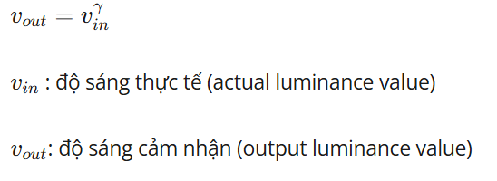

# Nhập Môn Xử Lý Ảnh Số - THI THỬ CUỐI KÌ

## XÁC ĐỊNH ĐỐI TƯỢNG TRONG ẢNH
- **Sinh Viên Thực Hiên:** Phạm Thế Hùng
- **MSSV:** 2374802010164
- **Môn Học:** Nhập Môn Xử Lý Ảnh Số
- **Giảng viên:** Đỗ Hữu Quân

## Câu 1: Cho ảnh có tên là a.jpg và thực hiện các yêu cầu:

## Công nghệ sử dụng
- **Python:** Ngôn ngữ chính
- **numpy:** Xử lý ảnh dưới dạng mảng số học
- **scipy:**  giải quyết các bài toán kỹ thuật và toán học phức tạp
- **skimage:** xử lý và phân tích hình ảnh
- **imageio:** Đọc file ảnh với định dạng hiện đại
- **matplotlib:** Hiển thị ảnh trực quan
- **random:** Tạo ra các giá trị ngẫu nhiên 

### Mean filter
**Mục đích:** Mean Filter là một kỹ thuật lọc ảnh tuyến tính được sử dụng phổ biến trong xử lý ảnh số. Mục tiêu chính của nó là làm mờ ảnh để giảm nhiễu và làm mịn các chi tiết nhỏ. Giảm nhiễu, làm mịn ảnh, làm mờ các chi tiết sắc nét
**Nguyên Lý:** Mean Filter hoạt động bằng cách thay thế giá trị của mỗi điểm ảnh bằng giá trị trung bình của các điểm ảnh xung quanh nó trong một vùng cửa sổ kernel, thường là 3×3, 5×5,...

**Code chính:**
```python
a = iio.imread('a.jpg',  mode = "F")
k = np.ones((5, 5)) / 25
b = sn.convolve(a, k).astype(np.uint8)
```
### Ở đây em dùng sobel filter xác định biên của hình ảnh trên

**Mục đích:** Sobel filter được sử dụng phổ biến trong xử lý ảnh để phát hiện biên. Nó giúp làm nổi bật những vùng có sự thay đổi cường độ sáng mạnh, như đường viền góc cạnh những đặc điểm rất quan trọng trong việc nhận diện đối tượng, phân vùng ảnh hay dẫn hướng trong thị giác máy tính

**Nguyên Lý:** Bộ lọc Sobel dựa trên phương pháp tính đạo hàm của cường độ ảnh theo hai hướng:
- X: phát hiện biên theo chiều dọc.
- Y: phát hiện biên theo chiều ngang.

**Code chính:**
```python
c = filters.sobel(b)
c = (c * 255).astype(np.uint8)

```
### Chuyển đổi BGR sang RGB
**Mục đích:** Trong xử lý ảnh kỹ thuật số, nhiều thư viện như OpenCV sử dụng định dạng màu BGR, trong khi phần lớn các hệ thống hiển thị và xử lý ảnh sử dụng RGB. Việc chuyển đổi là cần thiết để:
- Hiển thị màu sắc chính xác trên các nền tảng khác nhau
- Tránh sai lệch màu khi trích xuất hoặc trực quan hóa ảnh
- Chuẩn hóa dữ liệu màu đầu vào trong các ứng dụng học sâu hoặc xử lý ảnh nâng cao


**Nguyên Lý:** Việc chuyển đổi chỉ đơn giản là hoán đổi vị trí kênh màu, vì cả hai đều dùng hệ thống 3 kênh nhưng theo thứ tự khác:
- BGR có thứ tự: Blue (Xanh dương) – Green (Xanh lá) – Red (Đỏ)
- RGB có thứ tự: Red – Green – Blue


**Code chính:**
```python
data = iio.imread("a.jpg")
kenh_mau = [0, 1, 2]
random.shuffle(kenh_mau)
bdata = data[:, :, kenh_mau]
iio.imsave("a_random_color.jpg", bdata )
```

### Chuyển ảnh sang không gian màu HSV và tách riêng kênh Hue, Saturation, Value

**Mục đích:** Việc chuyển ảnh từ hệ màu RGB/BGR sang HSV là một bước quan trọng trong xử lý ảnh vì HSV tách biệt rõ ràng các yếu tố của màu sắc, cho phép xử lý chúng dễ dàng hơn trong các tác vụ phân tích màu sắc, phân đoạn ảnh, cải thiện tương phản và ánh sáng, phân loại và nhận dạng đối tượng dựa trên sắc độ hoặc độ bão hòa

**Nguyên Lý:** HSV là hệ màu biểu diễn theo trực quan của con người:
- Hue (Sắc độ): góc quay trên vòng màu 0–360 độ thể hiện màu cơ bản
- Saturation (Độ bão hòa): mức độ rực rỡ của màu 0 = màu xám, 255 = màu đặm
- Value (Độ sáng): độ sáng của màu 0 = đen, 255 = sáng nhất

**Code chính:**
```python
rgb = iio.imread("a.jpg")
rgb2hsv = np.vectorize(colorsys.rgb_to_hsv)
h,s,v = rgb2hsv(rgb[:,:,0], rgb[:,:,1], rgb[:,:,2])
h_img = (h * 255).astype(np.uint8)
s_img = (s * 255).astype(np.uint8)
v_img = (v * 255).astype(np.uint8)
iio.imwrite("a_hue.jpg", h_img)
iio.imwrite("a_saturation.jpg", s_img)
iio.imwrite("a_value.jpg", v_img)
```

## Câu 2: Viết một chương trình Python sử dụng OpenCV để tạo menu động cho phép người dùng chọn các phương pháp biến đổi ảnh từ một danh sách mở rộng, áp dụng cho nhiều ảnh cùng lúc, và thực hiện các phân tích bổ sung. Các yêu cầu cụ thể:

Ở bài này thì có 2 yêu cầu:
- 1: là chọn 1 trong 6 phương pháp xử lý ảnh và xử lý cùng lúc 3 ảnh
- 2: cũng như yêu cầu khác hơn chút là gán các lựa chọn bằng các chữ cái đầu của các phương pháp xử lý ảnh và lưu ảnh dưới dạng output_inverse_1.jpg, output_gamma_2.jpg,...
### Image inverse transformation
**Mục đích:** Image Inverse Transformation là một bước khôi phục hoặc đảo ngược quá trình xử lý đã áp dụng lên ảnh. Mục đích chính là khôi phục dữ liệu gốc,hiệu chỉnh sai lệch nếu ảnh bị biến dạng do hệ thống camera hay ánh sáng, biến đổi ngược có thể giúp đưa ảnh về trạng thái cân bằng.

**Nguyên Lý:** Biến đổi ảnh thường dùng ma trận biến đổi tuyến tính như biến đổi affine hoặc đồng nhất. Khi bạn đã áp dụng biến đổi T lên ảnh đầu vào để đảo ngược bạn sẽ dùng ma trận nghịch đảo của T, ký hiệu là T^-1.

**Code chính:**
```python
img = Image.open(name).convert("L")
im_1 = np.asarray(img)
img_2 = 255 - im_1
new_img = Image.fromarray(img_2)
```


### Gamma-Correction
**Mục đích:** Gamma Correction là một kỹ thuật quan trọng trong xử lý ảnh và hiển thị hình ảnh nhằm điều chỉnh độ sáng phi tuyến để phù hợp với cách mắt người cảm nhận ánh sáng

**Nguyên Lý:** Gamma Correction áp dụng hàm phi tuyến dạng mũ để biến đổi cường độ pixel theo công thức:

- ()

**Code chính:**
```python
img = Image.open(name).convert("L")
im_3 = np.asarray(img)
gamma = 0.5
b1 = im_3.astype(float)
b2 = np.max(b1)
b3 = b1/b2
c = (np.exp(b3) * 255.0).astype(np.uint8) 
d = Image.fromarray(c)
```

### Log Transformation
**Mục đích:** 

**Nguyên Lý:** 

**Code chính:**
```python

```


**Mục đích:** 

**Nguyên Lý:** 

**Code chính:**
```python

```